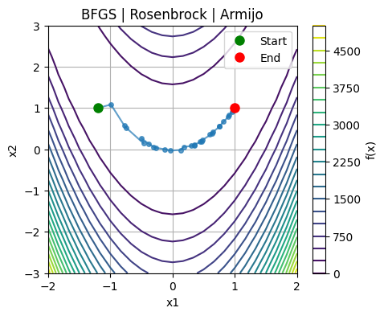
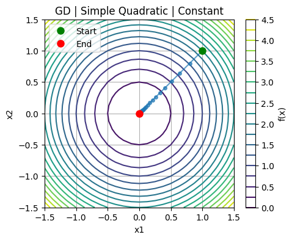

<div align="center">
  
  
</div>


# optim

Collection of popular optimization algorithms in PyTorch.


## Overview

This repository contains implementations of various optimization algorithms using PyTorch for automatic differentiation. The library is designed to be modular, configurable via Hydra, and easy to extend with new algorithms and functions. The repository is compatible with cpu, gpu and subclasses the native PyTorch optimizer for seamless integration.  


## Available Algorithms
Currently Released:
- Gradient Descent (`gd.py`): classic fast first-order method 
- Newton's Method (`newton.py`): powerful (but slower) second-order method
- BFGS (`bfgs.py`): hybrid Quasi-Newton (approximate second-order) method
- Support for constant step size and line search via backtracking with the Armijo condition

Coming Soon: 
- L-BFGS (`l-bfgs.py`): memory efficient BFGS method
- DFP (`dfp.py`): hybrid Quasi-Newton (approximate second-order) method
- TRNewtonCG (`tr_newton_cg.py`): trust region Newton method with conjugate gradient subproblem solver
- TRSR1CG (`tr_sr1_cg.py`): SR1 Quasi-Newton method with conjugate gradient subproblem solver
- Support for line search via backtracking with Wolfe conditions


## Installation

1. Clone the repository:
   ```bash
   git clone https://github.com/yourusername/optim.git
   cd optim
   ```

2. Create a virtual environment (optional but recommended):
   ```bash
   conda create -n optim python=3.10
   conda activate optim
   ```

3. Install the requirements:
   ```bash
   pip install -r requirements.txt
   ```


## Usage

### Running Optimization with Different Configurations

The main script `scripts/run.py` uses Hydra for configuration management. Modify the appropriate configuration files (see more below) and run:

```bash
python scripts/run.py
```

### Configuration Structure

The configuration files are located in the `configs` directory:
- `config.yaml`: Main configuration file
- `function/*.yaml`: Function configurations (quadratic, rosenbrock, func2, func3, etc.)
- `algorithm/*.yaml`: Algorithm configurations (gd, newton, bfgs, etc.)

### Available Test Notebooks

To quickly visualize different algorithms, feel free to run our test notebooks (`test/algorithms/*.ipynb`) which work out of the box with no configuration.  


## Author

Nikhil Sridhar with inspiration from Prof. Albert Berahas's MATH 562 class @ the University of Michigan. 


## License

MIT License 
